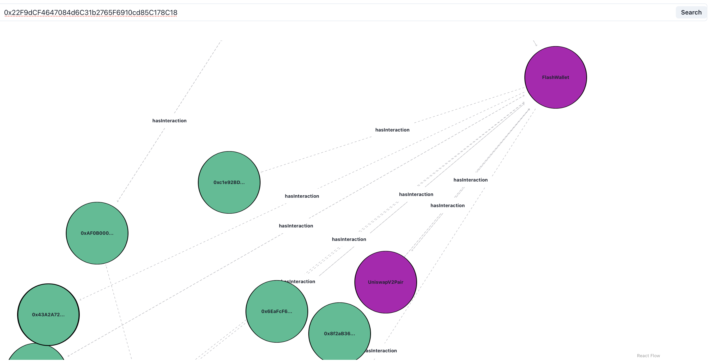

The client interface interacting with Seshat base layer.
<!-- 
SocialBlock is the first cross-site cookie for blockchain, providing users of decentralized applications (dApps) with seamless and highly personalized experiences no matter where they are in the decentralized world.

For now to interact with the graph interactive module you just need to visit socialblock.vercel.app, search for an address like: 0x22F9dCF4647084d6C31b2765F6910cd85C178C18, and wait for a moment :). The result would be like below:
 -->

## Setup

    npm i
    npm run dev

